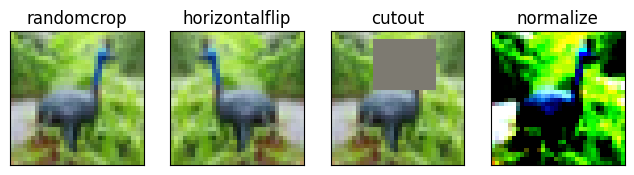
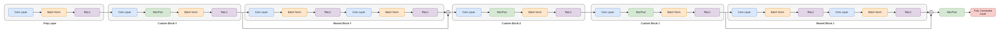
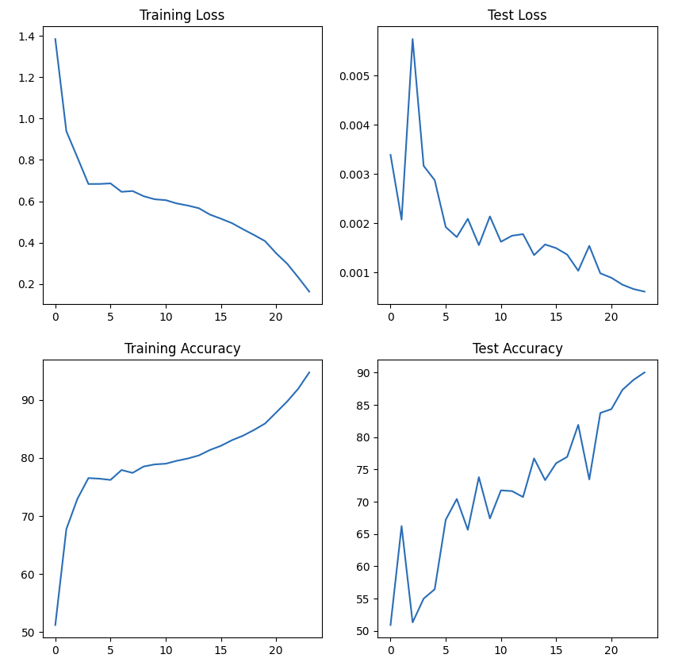
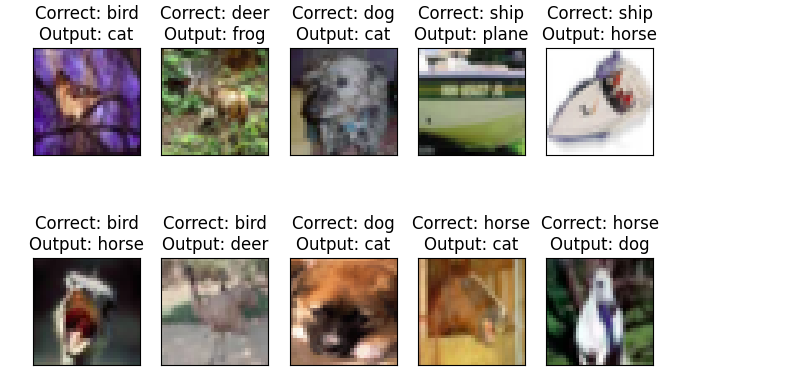
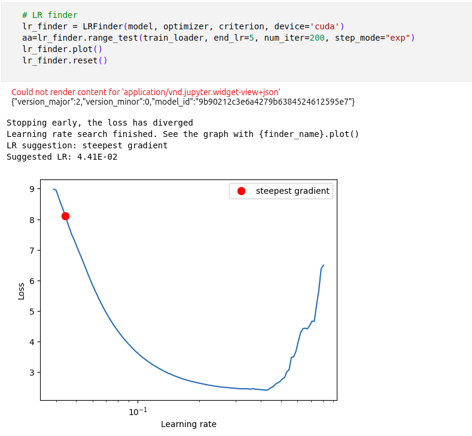
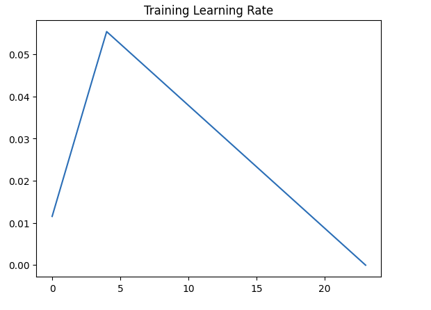

# Accelerated Training with Learning Rate Annealing(one Cycle Policy)

This repository contains following files:

- `S10`: This notebook uses the EVA2-Master repository and extensively uses below files for processing:
    - `custom_resnet.py`: Model Architecture by [David C](https://github.com/davidcpage)
    - `dataset.py`: This script contains class to use with Albumentations (https://github.com/albumentations-team/albumentations) library with PyTorch dataset
    - `training_utils`: This script contains `train`, `test` functions required for model training along with `get_lr` function to get current learning rate
    - `utils.py`: This script  contains utility functions to visualize data samples, augmentations, misclassified images, dataset statistics and model summary. 


## Code Details

- In the above notebook, following steps are performed to achieve **90%+** accuracy on CIFAR10 dataset in **24 epochs**

### After importing all the modules and files in this repository, CIFAR10 statistics is printed

  ```python
  from utils import get_cifar_statistics
  
  get_cifar_statistics(train)
  get_cifar_statistics(test, data_set_type="Test")
  ```

  ```
  [Train]
   - Total Train Images: 50000
   - Tensor Shape: (3, 32, 32)
   - min: (0.0, 0.0, 0.0)
   - max: (1.0, 1.0, 1.0)
   - mean: (0.49139968, 0.48215827, 0.44653124)
   - std: (0.24703233, 0.24348505, 0.26158768)
   - var: (0.061024975, 0.05928497, 0.06842812)
  [Test]
   - Total Test Images: 10000
   - Tensor Shape: (3, 32, 32)
   - min: (0.0, 0.0, 0.0)
   - max: (1.0, 1.0, 1.0)
   - mean: (0.49421427, 0.48513183, 0.45040932)
   - std: (0.24665256, 0.24289224, 0.26159248)
   - var: (0.06083748, 0.058996636, 0.06843062)
  ```

### Data samples are visualized

  ```python
  from visualize import display_cifar_data_samples
  
  DISPLAY_SAMPLES = 20
  sample, _ = train[4]
  display_cifar_data_samples(train, DISPLAY_SAMPLES, classes)
  ```

  

### Augmentation is performed and visualized

  ```python
  from utils import visualize_cifar_augmentation
  
  aug_train = TransformedDataset('./data', train=True, download=True)
  
  aug_set_transforms = {
      'randomcrop': A.RandomCrop(height=32, width=32, p=1),
      'horizontalflip': A.HorizontalFlip(p=1),
      'cutout': A.CoarseDropout(max_holes=1, max_height=16, max_width=16, min_holes=1, min_height=1, min_width=1, fill_value=(0.49139968*255, 0.48215827*255, 0.44653124*255), mask_fill_value=None, p=1),
      'normalize': A.Normalize((0.49139968, 0.48215827 ,0.44653124), (0.24703233, 0.24348505, 0.26158768)),
      'standardize': ToTensorV2(),
  }
  
  visualize_cifar_augmentation(aug_train, aug_set_transforms)
  ```



### David's custom model is recreated and imported

### ResNet, short for Residual Network, 
Resnet is a type of deep neural network architecture that is widely used for various computer vision tasks, such as image classification, object detection, and semantic segmentation. It was introduced by Kaiming He et al. in their paper "Deep Residual Learning for Image Recognition" in 2015.

The primary innovation of ResNet lies in its use of residual connections, also known as skip connections or shortcut connections. These connections allow information to bypass one or more layers, facilitating the training of very deep networks. The intuition behind residual connections is that it is easier for a neural network to learn residual functions (the difference between the input and output of a layer) rather than learn the entire transformation from scratch.

- Basic Building Blocks: The basic building block of ResNet is the residual block. A residual block typically consists of two convolutional layers with batch normalization and ReLU activation functions, and a shortcut connection. The shortcut connection adds the original input of the block to the output of the two convolutional layers.

- Skip Connections: These shortcut connections enable the flow of information through the network even if the layers are stacked very deep. They help in avoiding the vanishing gradient problem which can occur in very deep networks during training. With these connections, even if a layer makes the learning worse, it can always fall back to the identity function.

- Network Depth: ResNet architectures can be very deep, often exceeding 100 layers. The depth of the network is one of the key factors contributing to its effectiveness. Deeper networks have been shown to capture more complex features, leading to improved performance on various tasks.

- Variants: There are several variants of ResNet, including ResNet-18, ResNet-34, ResNet-50, ResNet-101, and ResNet-152. The numbers in the names denote the total number of layers in the network. For instance, ResNet-50 has 50 layers. The deeper variants typically perform better but require more computational resources.

- Applications: ResNet architectures have been highly successful in various computer vision tasks, particularly in image classification competitions such as ImageNet Large Scale Visual Recognition Challenge (ILSVRC), where they have achieved state-of-the-art performance.

Overall, ResNet's innovation in utilizing residual connections has made it a fundamental architecture in the field of deep learning, demonstrating the importance of network depth and facilitating the training of extremely deep neural networks.



- Training Model

```python
  from training_utils import train, test, get_lr
  
  # Data to plot accuracy and loss graphs
  train_losses = []
  test_losses = []
  train_acc = []
  test_acc = []
  learning_rates = []
  test_incorrect_pred = {'images': [], 'ground_truths': [], 'predicted_vals': []}
  
  # Scheduler
  scheduler = torch.optim.lr_scheduler.OneCycleLR(optimizer,
                                                  max_lr=MAX_LR,
                                                  steps_per_epoch=STEPS_PER_EPOCH,
                                                  epochs=EPOCHS,
                                                  pct_start=5/EPOCHS,
                                                  div_factor=100,
                                                  three_phase=False,
                                                  final_div_factor=100,
                                                  anneal_strategy="linear"
                                                  )
  
  # For each epoch
  for epoch in range(1, EPOCHS+1):
      print(f'Epoch {epoch}')
  
      # Train the model on training dataset and append the training loss and accuracy
      correct, processed, train_loss = train(model, device, train_loader, optimizer, criterion, scheduler)
      train_acc.append(100 * correct / processed)
      train_losses.append(train_loss / len(train_loader))
      learning_rates.append(get_lr(optimizer))
  
      # Test the model's performance on test dataset and append the training loss and accuracy
      correct, test_loss = test(model, device, test_loader, criterion)
      test_acc.append(100. * correct / len(test_loader.dataset))
      test_losses.append(test_loss)
```

```
Epoch 1
Train: Loss=1.0805 Batch_id=97 Accuracy=50.51: 100%|██████████| 98/98 [00:07<00:00, 13.06it/s]
Test set: Average loss: 0.0023, Accuracy: 5957/10000 (59.57%)

Epoch 2
Train: Loss=0.7766 Batch_id=97 Accuracy=68.12: 100%|██████████| 98/98 [00:07<00:00, 13.10it/s]
Test set: Average loss: 0.0023, Accuracy: 6462/10000 (64.62%)

Epoch 3
Train: Loss=0.6488 Batch_id=97 Accuracy=74.20: 100%|██████████| 98/98 [00:07<00:00, 13.07it/s]
Test set: Average loss: 0.0016, Accuracy: 7268/10000 (72.68%)

Epoch 4
Train: Loss=0.6254 Batch_id=97 Accuracy=77.13: 100%|██████████| 98/98 [00:07<00:00, 13.07it/s]
Test set: Average loss: 0.0013, Accuracy: 7798/10000 (77.98%)

Epoch 5
Train: Loss=0.6575 Batch_id=97 Accuracy=77.58: 100%|██████████| 98/98 [00:07<00:00, 13.08it/s]
Test set: Average loss: 0.0017, Accuracy: 7230/10000 (72.30%)

Epoch 6
Train: Loss=0.5282 Batch_id=97 Accuracy=78.67: 100%|██████████| 98/98 [00:07<00:00, 13.08it/s]
Test set: Average loss: 0.0017, Accuracy: 7115/10000 (71.15%)

Epoch 7
Train: Loss=0.6734 Batch_id=97 Accuracy=79.27: 100%|██████████| 98/98 [00:07<00:00, 13.10it/s]
Test set: Average loss: 0.0022, Accuracy: 6463/10000 (64.63%)

Epoch 8
Train: Loss=0.5245 Batch_id=97 Accuracy=79.87: 100%|██████████| 98/98 [00:07<00:00, 13.10it/s]
Test set: Average loss: 0.0014, Accuracy: 7592/10000 (75.92%)

Epoch 9
Train: Loss=0.5654 Batch_id=97 Accuracy=80.51: 100%|██████████| 98/98 [00:07<00:00, 13.11it/s]
Test set: Average loss: 0.0016, Accuracy: 7241/10000 (72.41%)

Epoch 10
Train: Loss=0.5493 Batch_id=97 Accuracy=80.92: 100%|██████████| 98/98 [00:07<00:00, 13.10it/s]
Test set: Average loss: 0.0014, Accuracy: 7583/10000 (75.83%)

Epoch 11
Train: Loss=0.4929 Batch_id=97 Accuracy=81.81: 100%|██████████| 98/98 [00:07<00:00, 13.09it/s]
Test set: Average loss: 0.0013, Accuracy: 7803/10000 (78.03%)

Epoch 12
Train: Loss=0.5398 Batch_id=97 Accuracy=82.04: 100%|██████████| 98/98 [00:07<00:00, 13.13it/s]
Test set: Average loss: 0.0021, Accuracy: 6569/10000 (65.69%)

Epoch 13
Train: Loss=0.6974 Batch_id=97 Accuracy=82.19: 100%|██████████| 98/98 [00:07<00:00, 13.10it/s]
Test set: Average loss: 0.0014, Accuracy: 7649/10000 (76.49%)

Epoch 14
Train: Loss=0.4259 Batch_id=97 Accuracy=83.02: 100%|██████████| 98/98 [00:07<00:00, 13.10it/s]
Test set: Average loss: 0.0016, Accuracy: 7337/10000 (73.37%)

Epoch 15
Train: Loss=0.4714 Batch_id=97 Accuracy=83.46: 100%|██████████| 98/98 [00:07<00:00, 13.14it/s]
Test set: Average loss: 0.0012, Accuracy: 8057/10000 (80.57%)

Epoch 16
Train: Loss=0.4747 Batch_id=97 Accuracy=84.26: 100%|██████████| 98/98 [00:07<00:00, 13.11it/s]
Test set: Average loss: 0.0012, Accuracy: 7999/10000 (79.99%)

Epoch 17
Train: Loss=0.3966 Batch_id=97 Accuracy=84.93: 100%|██████████| 98/98 [00:07<00:00, 13.13it/s]
Test set: Average loss: 0.0013, Accuracy: 7734/10000 (77.34%)

Epoch 18
Train: Loss=0.4154 Batch_id=97 Accuracy=85.77: 100%|██████████| 98/98 [00:07<00:00, 13.13it/s]
Test set: Average loss: 0.0012, Accuracy: 8068/10000 (80.68%)

Epoch 19
Train: Loss=0.3750 Batch_id=97 Accuracy=86.95: 100%|██████████| 98/98 [00:07<00:00, 13.10it/s]
Test set: Average loss: 0.0011, Accuracy: 8146/10000 (81.46%)

Epoch 20
Train: Loss=0.3935 Batch_id=97 Accuracy=88.43: 100%|██████████| 98/98 [00:07<00:00, 13.08it/s]
Test set: Average loss: 0.0008, Accuracy: 8637/10000 (86.37%)

Epoch 21
Train: Loss=0.3273 Batch_id=97 Accuracy=89.74: 100%|██████████| 98/98 [00:07<00:00, 13.10it/s]
Test set: Average loss: 0.0009, Accuracy: 8517/10000 (85.17%)

Epoch 22
Train: Loss=0.2634 Batch_id=97 Accuracy=91.67: 100%|██████████| 98/98 [00:07<00:00, 13.04it/s]
Test set: Average loss: 0.0007, Accuracy: 8777/10000 (87.77%)

Epoch 23
Train: Loss=0.1449 Batch_id=97 Accuracy=93.79: 100%|██████████| 98/98 [00:07<00:00, 13.11it/s]
Test set: Average loss: 0.0006, Accuracy: 8945/10000 (89.45%)

Epoch 24
Train: Loss=0.1060 Batch_id=97 Accuracy=96.22: 100%|██████████| 98/98 [00:07<00:00, 13.12it/s]
Test set: Average loss: 0.0006, Accuracy: 9071/10000 (90.71%)
```

### One Cycle Policy is used to train the models. Following is the graph showing model accuracy and loss on train and test dataset

```python
  # Print loss and accuracy
  from utils import display_loss_and_accuracies
  
  display_loss_and_accuracies(train_losses, train_acc, test_losses, test_acc)
```



- Misclassified images are visualized

  ```python
  from utils import get_misclassified_data
  from utils import display_cifar_misclassified_data
  
  # Denormalize the data using test mean and std deviation
  inv_normalize = transforms.Normalize(
      mean=[-0.4942/0.2466, -0.4851/0.2428, -0.4504/0.2615],
      std=[1/0.2466, 1/0.2428, 1/0.2615]
  )
  
  # Get the misclassified data from test dataset
  misclassified_data = get_misclassified_data(model, device, test_loader)
  
  # Plot the misclassified data
  display_cifar_misclassified_data(misclassified_data, classes, inv_normalize, number_of_samples=10)
  ```
  
  

  ---


## One Cycle Policy

- The One Cycle Policy, pioneered by Leslie Smith, is outlined in detail in his paper here.

- This policy comprises three distinct phases:

    - Initially, the learning rate is progressively increased from its initial value to the maximum learning rate.
    - Subsequently, the learning rate is gradually decreased from the maximum value to the designated end learning rate.
    - The annealing phase ensues, during which the learning rate undergoes further reduction based on a predefined strategy.

- In adherence to the One Cycle Policy, we commence with a minimal learning rate, incrementing it iteratively until it reaches the maximum threshold. 
- Subsequently, we decrease it gradually until it reaches the minimum threshold.

- By elevating the learning rate during the initial phase, the model endeavors to surmount local minima, thereby striving to converge towards the global minimum.

- Following a predetermined number of epochs, the learning rate is tapered off to facilitate the model's convergence towards the global minimum.

- Implementing the One Cycle Policy involves two key steps:

    - Utilizing the lr_finder technique to ascertain the maximum learning rate.
    - Incorporating the OneCycle learning rate scheduler into the training process.

### Step-1 [Find Max LR]

- Install and import lr_finder

  ```python
  # Install and import lr-finder
  !pip install torch-lr-finder
  from torch_lr_finder import LRFinder
  ```

- Select model, optimizer and loss function

  ```python
  # Put the model on selected device
  model = Session10Net().to(device)
  
  # Optimization algorithm to update the weights
  LEARNING_RATE = 0.03
  WEIGHT_DECAY = 1e-4
  optimizer = optim.Adam(model.parameters(), lr=LEARNING_RATE, weight_decay=WEIGHT_DECAY)
  
  # Loss Function
  criterion = nn.CrossEntropyLoss()
  ```

- Get the max learning rate value

  ```python
  # LR finder
  lr_finder = LRFinder(model, optimizer, criterion, device='cuda')
  lr_finder.range_test(train_loader, end_lr=10, num_iter=200, step_mode="exp")
  lr_finder.plot()
  lr_finder.reset()
  ```

  The above will print out following statements and graph

  ```bash
  Stopping early, the loss has diverged
  Learning rate search finished. See the graph with {finder_name}.plot()
  LR suggestion: steepest gradient
  Suggested LR:4.41E-02
  ```

  

- The graphs shows how the loss value is affected by different values of learning rate

- As per the graph, rate of change of loss value is maximum for a learning rate of `4.41E-02`

- So, we will consider this as the maximum value of the learning rate


### Step-2 [Implementation]

- To implement this policy, we need to use a scheduler from PyTorch

  ```python
  # Scheduler
  scheduler = torch.optim.lr_scheduler.OneCycleLR(optimizer,
                                                  max_lr=4.41E-02,
                                                  steps_per_epoch=len(train_loader),
                                                  epochs=24,
                                                  pct_start=5/24,
                                                  div_factor=100,
                                                  three_phase=False,
                                                  final_div_factor=100,
                                                  anneal_strategy="linear"
                                                  )
  ```

  `max_lr`: Maximum value of learning rate found in step-1

  `steps_per_epoch`: Number of times learning rate to be modified in each epoch

  `epochs`: Total number of epochs

  `pct_start`: For what percentage of total epochs, learning rate should be raising (Usually 20-30%)

  `div_factor`: Starting learning rate to be decided by dividing maximum learning rate by this value (Usually 100)

  `three_phase`: Selecting if annealing phase to be used

  `final_div_factor`: End learning rate to be decided by dividing maximum learning rate by this value (Usually 100)

  `anneal_strategy`: Strategy to be used in annealing phase

- After using the scheduler for model training, the learning rate variation looks like this

  

  
